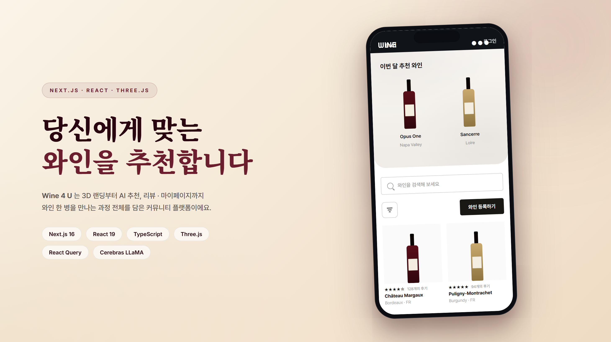
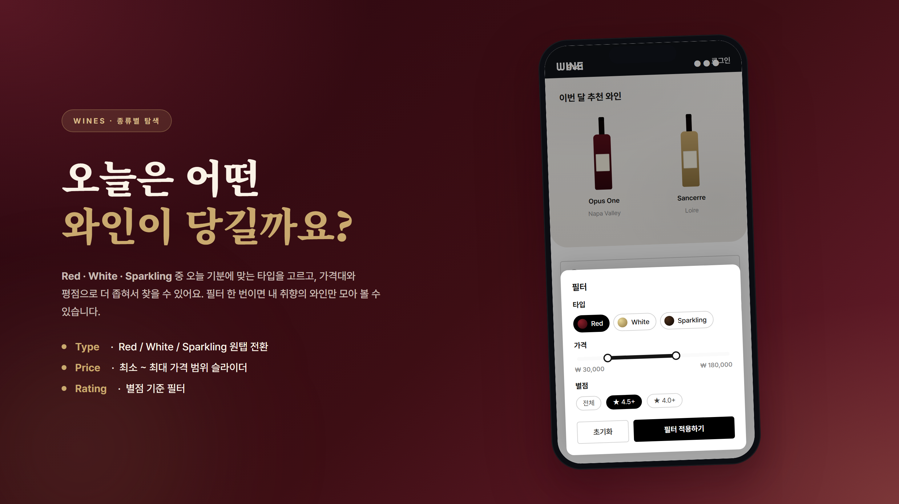
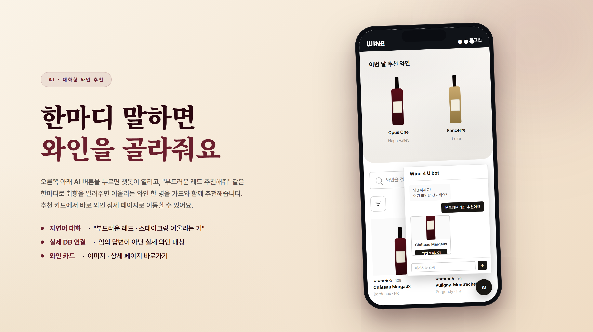
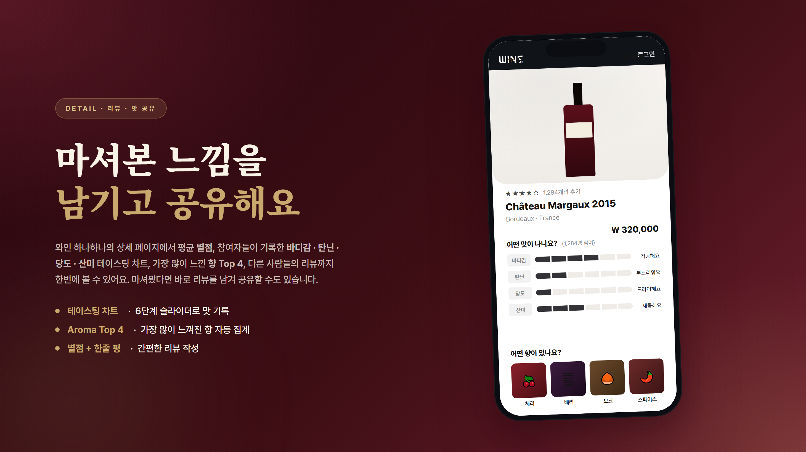
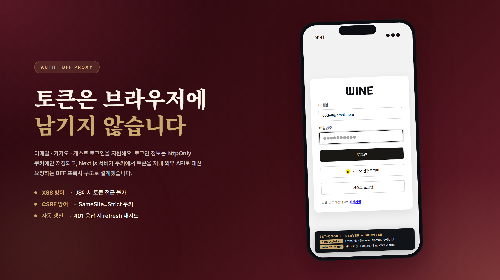

<br />



<br/>
<br/>

# 🍷 Wine 4 U

[](https://nextjs.org/) [](https://react.dev/) [](https://www.typescriptlang.org/) [](https://tailwindcss.com/) [](https://threejs.org/) [](https://tanstack.com/query) [](https://www.cerebras.net/)

<br />

**🍷 와인을 찾고, 고르고, 기록하는 커뮤니티, Wine 4 U**

'Wine 4 U'는 3D 인터랙티브 랜딩부터 AI 기반 와인 추천, 리뷰 · 테이스팅 공유, 마이페이지까지 와인 한 병을 만나는 과정 전체를 담은 Next.js 16 커뮤니티 플랫폼입니다.

<br />

<br />



Red · White · Sparkling 세 가지 타입 중 오늘 기분에 맞는 와인을 고르고, 가격대와 별점 필터로 원하는 와인만 모아 볼 수 있어요.

<br />

<br />



오른쪽 아래 AI 버튼을 누르면 챗봇이 열려요. 한마디로 취향을 알려주면 실제 DB의 와인 중 어울리는 한 병을 카드로 추천해줍니다.

<br />

<br />



와인의 평균 별점과 함께 바디감 · 탄닌 · 당도 · 산미 테이스팅 차트, 가장 많이 느껴진 향 Top 4, 다른 사람들의 리뷰까지 한 화면에 모여 있어요. 마셔봤다면 직접 리뷰를 남겨 맛을 공유할 수도 있습니다.

<br />

<br />



로그인 시 JWT는 `httpOnly` 쿠키에만 저장되고, Next.js 서버가 BFF 프록시로 외부 API를 대신 호출합니다. 브라우저에 토큰이 노출되지 않아요.

<br />

<br />

## 😎 Development Description

- **Next.js API Route를 BFF 프록시**로 활용해 JWT를 httpOnly 쿠키에만 두고, 401 응답 시 서버에서 `refresh_token`으로 자동 재발급·재시도합니다.
- **Three.js + React Three Fiber**로 랜딩 3D 모델을 렌더링하고, GLB 선제 프리로드와 스크롤 진행률 기반 애니메이션으로 초기 렌더 지연을 줄였어요.
- **Cerebras LLaMA 3.3-70B** 챗봇 응답을 구조화된 JSON으로 파싱해, 실제 DB의 와인 ID에 매핑한 추천 카드를 반환합니다.
- **ISR Full-Route Cache**(`revalidate: 60`)로 와인 목록 페이지를 서버 단위로 캐싱했어요.
- **React Query `useInfiniteQuery`**로 커서 기반 무한 스크롤과 필터 캐시를 관리합니다.
- 서버 상태는 **React Query**, 클라이언트 상태는 **Zustand**로 이원화하고, 렌더링 에러는 ErrorBoundary로 선언적으로 처리해요.

<br />

<br />

## 🔐 BFF 프록시 흐름

### 로그인

```
Client                    Next.js Server                   External API
  │                            │                                │
  │  POST /api/auth/signIn     │                                │
  │  { email, password }       │                                │
  │ ──────────────────────────>│                                │
  │                            │  POST /auth/signIn             │
  │                            │ ──────────────────────────────>│
  │                            │  { accessToken, refreshToken } │
  │                            │ <──────────────────────────────│
  │                            │                                │
  │                            │  Set-Cookie:                   │
  │                            │    access_token  (httpOnly)    │
  │                            │    refresh_token (httpOnly)    │
  │  { user }                  │                                │
  │ <──────────────────────────│                                │
  │  (토큰은 반환하지 않음)     │                                │
```

### 데이터 요청 & 토큰 자동 갱신

```
Client (Axios)            Next.js Proxy                    External API
  │                            │                                │
  │  GET /api/wines            │                                │
  │  (쿠키 자동 포함)          │                                │
  │ ──────────────────────────>│  쿠키에서 access_token 추출    │
  │                            │  GET /wines                    │
  │                            │  Authorization: Bearer <token> │
  │                            │ ──────────────────────────────>│
  │  JSON 응답                 │            200 OK              │
  │ <──────────────────────────│ <──────────────────────────────│
  │                            │                                │
  │              ── 401 발생 시 자동 갱신 ──                    │
  │                            │  POST /auth/refresh-token      │
  │                            │ ──────────────────────────────>│
  │                            │  { accessToken }               │
  │                            │ <──────────────────────────────│
  │                            │  새 토큰으로 원래 요청 재시도  │
  │                            │ ──────────────────────────────>│
```

<br />

<br />

## 🧑🏻‍💻 Developers

| 역할    | 이름   | GitHub                           |
| ------- | ------ | -------------------------------- |
| 리드 FE | 김준석 | https://github.com/junhub98      |
| FE      | 박예성 | —                                |
| FE      | 이지선 | —                                |
